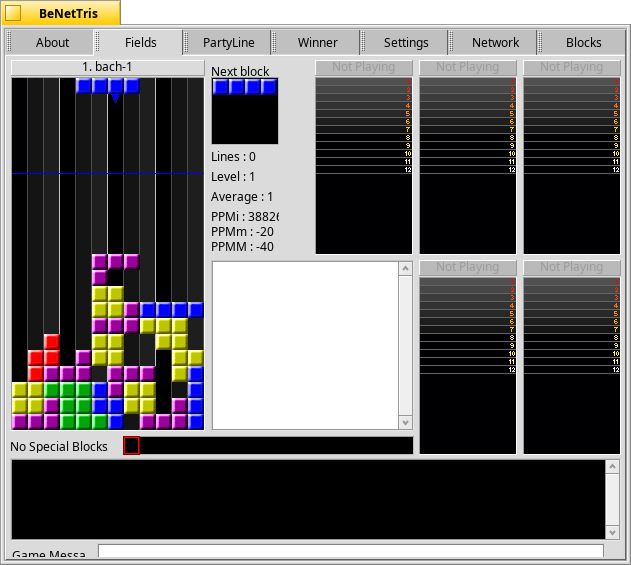

BeNetTris
====================
BeNetTris is a client and server compatible with V1.13 or V1.14 and Tetrinet TetriFast V1.13 or V1.14.

On the menu:
 - BeOS GUI 100 percent.
 - Possibility to connect to a remote server or start the local server.
 - All the possibilities of Tetrinet for Windows V1.13.
 - Still has a few commands Tetrinet manage and stabilize version ... 

License: GNU GPLv2  
Original Websites: http://sourceforge.net/projects/benettris/ and http://cvincent.pagesperso-orange.fr/logiciels/logiciels.html (in French)
